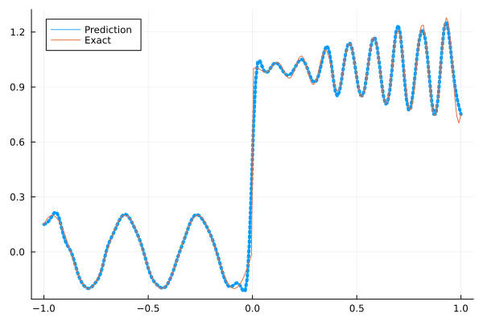
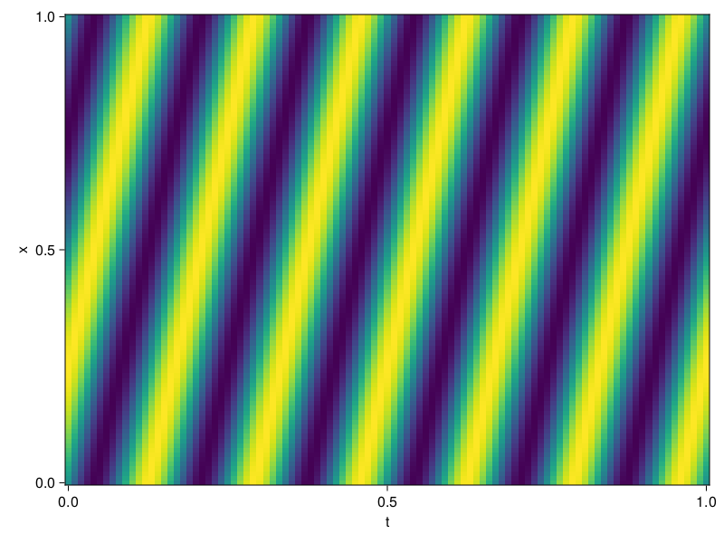
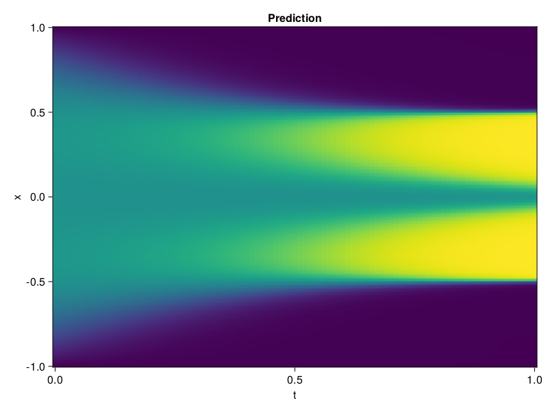

# Sophon

[](https://yichengdwu.github.io/Sophon.jl/stable/)
[](https://yichengdwu.github.io/Sophon.jl/dev/)
[](https://github.com/YichengDWu/Sophon.jl/actions/workflows/CI.yml?query=branch%3Amain)
[](https://codecov.io/gh/YichengDWu/Sophon.jl)
[](https://zenodo.org/badge/latestdoi/521846679)

`Sophon.jl` provides specialized neural networks and neural operators for Physics-informed machine learning. 

Use the [documentation](https://yichengdwu.github.io/Sophon.jl/dev/) to explore the features.

Please star this repository if you find it useful.

## Installation

To install Sophon, please open Julia's interactive session (REPL) and press ] key in the REPL to use the package mode, then type the following command

```julia
pkg> add Sophon
```
## Gallery
|      |                  |                 |                 |
|:---------------------------------------:|:-------------------------------------------------------------:|:------------------------------------------------------------:|:-----------------------------------------------------------:|
| [Function Fitting](https://yichengdwu.github.io/Sophon.jl/dev/tutorials/discontinuous/) | [Multi-scale Poisson Equation](https://yichengdwu.github.io/Sophon.jl/dev/tutorials/poisson/) | [Convection Equation](https://yichengdwu.github.io/Sophon.jl/dev/tutorials/convection/) | [Helmholtz Equation](https://yichengdwu.github.io/Sophon.jl/dev/tutorials/helmholtz/) |
|      |                  |                 |              |
| [Allen-Cahn Equation](https://yichengdwu.github.io/Sophon.jl/dev/tutorials/allen_cahn/) | [Schrödinger Equation](https://yichengdwu.github.io/Sophon.jl/dev/tutorials/Schr%C3%B6dingerEquation/) | [L-shaped Domain](https://yichengdwu.github.io/Sophon.jl/dev/tutorials/L_shape/) |  |

## Examples

More examples can be found in [Sophon-Examples](https://github.com/YichengDWu/Sophon-Examples)

## Related Libraries

- [NeuralPDE](https://github.com/SciML/NeuralPDE.jl)
- [PaddleScience](https://github.com/PaddlePaddle/PaddleScience)
- [MindScience](https://gitee.com/mindspore/mindscience)
- [Modulus](https://docs.nvidia.com/deeplearning/modulus/index.html#)
- [DeepXDE](https://deepxde.readthedocs.io/en/latest/index.html#)

## What's the difference between this package and NeuralPDE.jl?

The biggest difference is the explicit control over data sampling. Note that we have an example of an L-shape domain, and there is an example of a disk with a hole in this [file](https://github.com/YichengDWu/Sophon.jl/blob/main/docs/src/tutorials/hole.jl).
